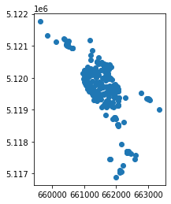
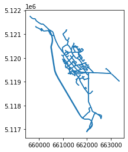
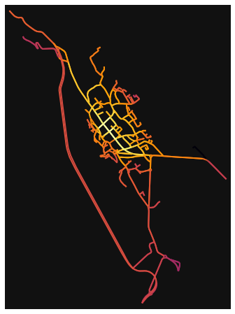
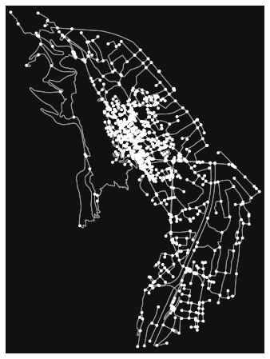

*Lesson 23 October 2020*
{: .no_toc }

## Table of contents
{: .no_toc .text-delta }

1. TOC
{:toc}

---

# Street Network Analysis

based on osnmx
goals of the tutorial

- basic concepts of network analysis
- routing
- bearing

based on the open data of:
- OpenStreetMap

requirements
- python knowledge
- geopandas
- openstreetmap

status<br/>
*“My Way”*


note:<br/>
you can also use pandana and the next integration of pyrosm with igraph

---

# Setup
for this tutorial we will use [OSMnx](https://github.com/gboeing/osmnx) = (openstreetmap + [networkx](https://networkx.org/))

Boeing, G. 2017. "[OSMnx: New Methods for Acquiring, Constructing, Analyzing, and Visualizing Complex Street Networks.](https://geoffboeing.com/publications/osmnx-complex-street-networks/)" *Computers, Environment and Urban Systems 65, 126-139. doi:10.1016/j.compenvurbsys.2017.05.004*

OSMnx need [rtree](https://toblerity.org/rtree/) a python wrapper to [libspatialindex](https://libspatialindex.org/en/latest/)

... we need to install libspatialindex if not exists on your OS.


```bash
try:
  import rtree
except ModuleNotFoundError as e:
  !apt-get install libspatialindex-dev
  !pip install rtree
  import rtree

```

    Reading package lists... Done
    Building dependency tree       
    Reading state information... Done
    The following additional packages will be installed:
      libspatialindex-c4v5 libspatialindex4v5
    The following NEW packages will be installed:
      libspatialindex-c4v5 libspatialindex-dev libspatialindex4v5
    0 upgraded, 3 newly installed, 0 to remove and 21 not upgraded.
    Need to get 555 kB of archives.
    After this operation, 3,308 kB of additional disk space will be used.
    Get:1 http://archive.ubuntu.com/ubuntu bionic/universe amd64 libspatialindex4v5 amd64 1.8.5-5 [219 kB]
    Get:2 http://archive.ubuntu.com/ubuntu bionic/universe amd64 libspatialindex-c4v5 amd64 1.8.5-5 [51.7 kB]
    Get:3 http://archive.ubuntu.com/ubuntu bionic/universe amd64 libspatialindex-dev amd64 1.8.5-5 [285 kB]
    Fetched 555 kB in 2s (258 kB/s)
    Selecting previously unselected package libspatialindex4v5:amd64.
    (Reading database ... 144611 files and directories currently installed.)
    Preparing to unpack .../libspatialindex4v5_1.8.5-5_amd64.deb ...
    Unpacking libspatialindex4v5:amd64 (1.8.5-5) ...
    Selecting previously unselected package libspatialindex-c4v5:amd64.
    Preparing to unpack .../libspatialindex-c4v5_1.8.5-5_amd64.deb ...
    Unpacking libspatialindex-c4v5:amd64 (1.8.5-5) ...
    Selecting previously unselected package libspatialindex-dev:amd64.
    Preparing to unpack .../libspatialindex-dev_1.8.5-5_amd64.deb ...
    Unpacking libspatialindex-dev:amd64 (1.8.5-5) ...
    Setting up libspatialindex4v5:amd64 (1.8.5-5) ...
    Setting up libspatialindex-c4v5:amd64 (1.8.5-5) ...
    Setting up libspatialindex-dev:amd64 (1.8.5-5) ...
    Processing triggers for libc-bin (2.27-3ubuntu1.2) ...
    /sbin/ldconfig.real: /usr/local/lib/python3.6/dist-packages/ideep4py/lib/libmkldnn.so.0 is not a symbolic link
    
    Collecting rtree
    [?25l  Downloading https://files.pythonhosted.org/packages/56/6f/f1e91001d5ad9fa9bed65875152f5a1c7955c5763168cae309546e6e9fda/Rtree-0.9.4.tar.gz (62kB)
         |████████████████████████████████| 71kB 1.1MB/s 
    [?25hRequirement already satisfied: setuptools in /usr/local/lib/python3.6/dist-packages (from rtree) (50.3.0)
    Building wheels for collected packages: rtree
      Building wheel for rtree (setup.py) ... [?25l[?25hdone
      Created wheel for rtree: filename=Rtree-0.9.4-cp36-none-any.whl size=21770 sha256=b619b818ac90325e9b1816ec15bf9fb9a1318d13716ba641b9b13fbc40fc24f7
      Stored in directory: /root/.cache/pip/wheels/ff/20/c5/0004ef7acb96745ec99be960053902b0b414a2aa2dcad5834e
    Successfully built rtree
    Installing collected packages: rtree
    Successfully installed rtree-0.9.4


... and now we can install OSMnx


```bash
!pip install osmnx
```

    Collecting osmnx
    [?25l  Downloading https://files.pythonhosted.org/packages/ed/91/ad30e3ed4d16140f975f05adc13c1ca0146d61438dfabe01bf66025a44e5/osmnx-0.16.1-py2.py3-none-any.whl (87kB)
         |████████████████████████████████| 92kB 1.3MB/s 
    [?25hRequirement already satisfied: networkx>=2.5 in /usr/local/lib/python3.6/dist-packages (from osmnx) (2.5)
    Collecting pyproj>=2.6
    [?25l  Downloading https://files.pythonhosted.org/packages/e5/c3/071e080230ac4b6c64f1a2e2f9161c9737a2bc7b683d2c90b024825000c0/pyproj-2.6.1.post1-cp36-cp36m-manylinux2010_x86_64.whl (10.9MB)
         |████████████████████████████████| 10.9MB 358kB/s 
    [?25hCollecting requests>=2.24
    [?25l  Downloading https://files.pythonhosted.org/packages/45/1e/0c169c6a5381e241ba7404532c16a21d86ab872c9bed8bdcd4c423954103/requests-2.24.0-py2.py3-none-any.whl (61kB)
         |████████████████████████████████| 71kB 7.7MB/s 
    [?25hCollecting geopandas>=0.8
    [?25l  Downloading https://files.pythonhosted.org/packages/f7/a4/e66aafbefcbb717813bf3a355c8c4fc3ed04ea1dd7feb2920f2f4f868921/geopandas-0.8.1-py2.py3-none-any.whl (962kB)
         |████████████████████████████████| 972kB 39.9MB/s 
    [?25hCollecting numpy>=1.19
    [?25l  Downloading https://files.pythonhosted.org/packages/63/97/af8a92864a04bfa48f1b5c9b1f8bf2ccb2847f24530026f26dd223de4ca0/numpy-1.19.2-cp36-cp36m-manylinux2010_x86_64.whl (14.5MB)
         |████████████████████████████████| 14.5MB 310kB/s 
    [?25hCollecting matplotlib>=3.3
    [?25l  Downloading https://files.pythonhosted.org/packages/cd/d6/8c4dfb23151d5a494c66ebbfdb5c8c433b44ec07fae52da5939fcda0943f/matplotlib-3.3.2-cp36-cp36m-manylinux1_x86_64.whl (11.6MB)
         |████████████████████████████████| 11.6MB 164kB/s 
    [?25hRequirement already satisfied: Rtree>=0.9 in /usr/local/lib/python3.6/dist-packages (from osmnx) (0.9.4)
    Requirement already satisfied: descartes>=1.1 in /usr/local/lib/python3.6/dist-packages (from osmnx) (1.1.0)
    Requirement already satisfied: pandas>=1.1 in /usr/local/lib/python3.6/dist-packages (from osmnx) (1.1.2)
    Requirement already satisfied: Shapely>=1.7 in /usr/local/lib/python3.6/dist-packages (from osmnx) (1.7.1)
    Requirement already satisfied: decorator>=4.3.0 in /usr/local/lib/python3.6/dist-packages (from networkx>=2.5->osmnx) (4.4.2)
    Requirement already satisfied: idna<3,>=2.5 in /usr/local/lib/python3.6/dist-packages (from requests>=2.24->osmnx) (2.10)
    Requirement already satisfied: chardet<4,>=3.0.2 in /usr/local/lib/python3.6/dist-packages (from requests>=2.24->osmnx) (3.0.4)
    Requirement already satisfied: urllib3!=1.25.0,!=1.25.1,<1.26,>=1.21.1 in /usr/local/lib/python3.6/dist-packages (from requests>=2.24->osmnx) (1.24.3)
    Requirement already satisfied: certifi>=2017.4.17 in /usr/local/lib/python3.6/dist-packages (from requests>=2.24->osmnx) (2020.6.20)
    Collecting fiona
    [?25l  Downloading https://files.pythonhosted.org/packages/36/8b/e8b2c11bed5373c8e98edb85ce891b09aa1f4210fd451d0fb3696b7695a2/Fiona-1.8.17-cp36-cp36m-manylinux1_x86_64.whl (14.8MB)
         |████████████████████████████████| 14.8MB 318kB/s 
    [?25hRequirement already satisfied: pyparsing!=2.0.4,!=2.1.2,!=2.1.6,>=2.0.3 in /usr/local/lib/python3.6/dist-packages (from matplotlib>=3.3->osmnx) (2.4.7)
    Requirement already satisfied: kiwisolver>=1.0.1 in /usr/local/lib/python3.6/dist-packages (from matplotlib>=3.3->osmnx) (1.2.0)
    Requirement already satisfied: cycler>=0.10 in /usr/local/lib/python3.6/dist-packages (from matplotlib>=3.3->osmnx) (0.10.0)
    Requirement already satisfied: python-dateutil>=2.1 in /usr/local/lib/python3.6/dist-packages (from matplotlib>=3.3->osmnx) (2.8.1)
    Requirement already satisfied: pillow>=6.2.0 in /usr/local/lib/python3.6/dist-packages (from matplotlib>=3.3->osmnx) (7.0.0)
    Requirement already satisfied: setuptools in /usr/local/lib/python3.6/dist-packages (from Rtree>=0.9->osmnx) (50.3.0)
    Requirement already satisfied: pytz>=2017.2 in /usr/local/lib/python3.6/dist-packages (from pandas>=1.1->osmnx) (2018.9)
    Collecting click-plugins>=1.0
      Downloading https://files.pythonhosted.org/packages/e9/da/824b92d9942f4e472702488857914bdd50f73021efea15b4cad9aca8ecef/click_plugins-1.1.1-py2.py3-none-any.whl
    Requirement already satisfied: attrs>=17 in /usr/local/lib/python3.6/dist-packages (from fiona->geopandas>=0.8->osmnx) (20.2.0)
    Collecting cligj>=0.5
      Downloading https://files.pythonhosted.org/packages/ba/06/e3440b1f2dc802d35f329f299ba96153e9fcbfdef75e17f4b61f79430c6a/cligj-0.7.0-py3-none-any.whl
    Requirement already satisfied: click<8,>=4.0 in /usr/local/lib/python3.6/dist-packages (from fiona->geopandas>=0.8->osmnx) (7.1.2)
    Collecting munch
      Downloading https://files.pythonhosted.org/packages/cc/ab/85d8da5c9a45e072301beb37ad7f833cd344e04c817d97e0cc75681d248f/munch-2.5.0-py2.py3-none-any.whl
    Requirement already satisfied: six>=1.7 in /usr/local/lib/python3.6/dist-packages (from fiona->geopandas>=0.8->osmnx) (1.15.0)
    ERROR: tensorflow 2.3.0 has requirement numpy<1.19.0,>=1.16.0, but you'll have numpy 1.19.2 which is incompatible.
    ERROR: google-colab 1.0.0 has requirement requests~=2.23.0, but you'll have requests 2.24.0 which is incompatible.
    ERROR: datascience 0.10.6 has requirement folium==0.2.1, but you'll have folium 0.8.3 which is incompatible.
    ERROR: albumentations 0.1.12 has requirement imgaug<0.2.7,>=0.2.5, but you'll have imgaug 0.2.9 which is incompatible.
    Installing collected packages: pyproj, requests, click-plugins, cligj, munch, fiona, geopandas, numpy, matplotlib, osmnx
      Found existing installation: requests 2.23.0
        Uninstalling requests-2.23.0:
          Successfully uninstalled requests-2.23.0
      Found existing installation: numpy 1.18.5
        Uninstalling numpy-1.18.5:
          Successfully uninstalled numpy-1.18.5
      Found existing installation: matplotlib 3.2.2
        Uninstalling matplotlib-3.2.2:
          Successfully uninstalled matplotlib-3.2.2
    Successfully installed click-plugins-1.1.1 cligj-0.7.0 fiona-1.8.17 geopandas-0.8.1 matplotlib-3.3.2 munch-2.5.0 numpy-1.19.2 osmnx-0.16.1 pyproj-2.6.1.post1 requests-2.24.0


Note: in the case of Colab you neet to restart the runtime (CTRL+M . ) and start from the next line (CTRL+F10)

# Let’s start with OSMnx


```python
import osmnx as ox
```

## prepare the data

... we can choose the same city used on the last tutorial 

[Mezzolombardo in Italy](https://www.openstreetmap.org/relation/46989#map=13/46.2067/11.1035)


```python
place_name = "Mezzolombardo, Italy"
```

.. and we can extract all the streets where it's possible to drive

OSMnx creates a overpass query to ask the data inside the area of name of the city and collect all the [highways](https://wiki.openstreetmap.org/wiki/Key:highway) where a car can move

Eg.<br/>
http://overpass-turbo.eu/s/Zid


```python
G = ox.graph_from_place(place_name, network_type='drive')
```

OSMnx transform the data from OpenStreetMap in [graph](https://networkx.org/documentation/stable/reference/introduction.html#graphs) for [networkx](https://networkx.org/)

# Graph Theory
text from [wikipedia](https://en.wikipedia.org/wiki/Graph_theory)


A graph is made up of **vertices** (also called *nodes* or *points*) which are connected by **edges** (also called *links* or *lines*)

A distinction is made between undirected graphs, where edges link two vertices symmetrically, and directed graphs, where edges link two vertices asymmetrically;


Example<br/>
undirected graph with three nodes and three edges. 


Example<br/>
a directed graph with three vertices and four directed edges<br/>(the double arrow represents an edge in each direction).


the type of graph generated by OSMnx is a MultiDiGraph: a directed graphs with self loops and parallel edges

more information [here](https://networkx.org/documentation/stable/reference/classes/multidigraph.html)


```python
type(G)
```


    networkx.classes.multidigraph.MultiDiGraph


OSMnx converts the graph from latitude/longitude (WGS83) to the right UTM coordinate reference system for the area selected


```python
G_proj = ox.project_graph(G)
```

from osmnx you can create geodataframes (gdfs) from a netxworkx Graph


```python
gdfs = ox.graph_to_gdfs(G_proj)
```


```python
type(gdfs)
```


    tuple


0 => nodes (points)<br/>
1 => edges (lines)


```python
type(gdfs[0])
```


    geopandas.geodataframe.GeoDataFrame


```python
gdfs[0].geometry.type.unique()
```


    array(['Point'], dtype=object)


```python
gdfs[1].geometry.type.unique()
```


    array(['LineString'], dtype=object)


extract only the nodes (projected)


```python
nodes_proj = ox.graph_to_gdfs(G_proj, edges=False, nodes=True)
```


```python
type(nodes_proj)
```


    geopandas.geodataframe.GeoDataFrame


```python
nodes_proj.crs
```


    <Projected CRS: +proj=utm +zone=32 +ellps=WGS84 +datum=WGS84 +unit ...>
    Name: unknown
    Axis Info [cartesian]:
    - E[east]: Easting (metre)
    - N[north]: Northing (metre)
    Area of Use:
    - undefined
    Coordinate Operation:
    - name: UTM zone 32N
    - method: Transverse Mercator
    Datum: World Geodetic System 1984
    - Ellipsoid: WGS 84
    - Prime Meridian: Greenwich


```python
nodes_proj.plot()
```


    

    


```python
lines_proj = ox.graph_to_gdfs(G_proj, nodes=False)
```


```python
lines_proj.plot()
```


    

    


... and we can use it as a normal geodaframe<br/>

Eg:<br/>
what sized area does our network cover in square meters?


```python
nodes_proj.unary_union.convex_hull
```


    

    


```python
graph_area_m = nodes_proj.unary_union.convex_hull.area
graph_area_m
```


    7185574.137222286


with OSMnx we can extract some basic statistics 


```python
ox.basic_stats(G_proj, area=graph_area_m, clean_intersects=True, circuity_dist='euclidean')
```


    {'circuity_avg': 1.064879568258031,
     'clean_intersection_count': 122,
     'clean_intersection_density_km': 16.978462356685295,
     'edge_density_km': 9583.241044482424,
     'edge_length_avg': 125.6589215328467,
     'edge_length_total': 68861.08899999999,
     'intersection_count': 193,
     'intersection_density_km': 26.859370777379198,
     'k_avg': 4.264591439688716,
     'm': 548,
     'n': 257,
     'node_density_km': 35.76610512842722,
     'self_loop_proportion': 0.0,
     'street_density_km': 5705.753251868747,
     'street_length_avg': 127.72309345794399,
     'street_length_total': 40999.11300000002,
     'street_segments_count': 321,
     'streets_per_node_avg': 2.5486381322957197,
     'streets_per_node_counts': {0: 0, 1: 64, 2: 1, 3: 179, 4: 13},
     'streets_per_node_proportion': {0: 0.0,
      1: 0.2490272373540856,
      2: 0.0038910505836575876,
      3: 0.6964980544747081,
      4: 0.05058365758754864}}


.. or simple plot directly the graph

or have more complex statitics based on the graph theory


```python
more_stats = ox.extended_stats(G, ecc=True, bc=True, cc=True)
for key in sorted(more_stats.keys()):
    print(key)
```

    avg_neighbor_degree
    avg_neighbor_degree_avg
    avg_weighted_neighbor_degree
    avg_weighted_neighbor_degree_avg
    betweenness_centrality
    betweenness_centrality_avg
    center
    closeness_centrality
    closeness_centrality_avg
    clustering_coefficient
    clustering_coefficient_avg
    clustering_coefficient_weighted
    clustering_coefficient_weighted_avg
    degree_centrality
    degree_centrality_avg
    diameter
    eccentricity
    pagerank
    pagerank_max
    pagerank_max_node
    pagerank_min
    pagerank_min_node
    periphery
    radius


## Glossary of the terms used by the statistics

For a complete list look the [networkx documentation](https://networkx.org/documentation/stable/)

- **density**<br/>defines the density of a graph. The density is 0 for a graph without edges and 1 for a complete graph. The density of multigraphs can be higher than 1.
- **center**<br/>is the set of points with eccentricity equal to radius.
- **betwnees centrality**<br/>is the number of possible interactions between two non-adjacent points
- **closeness centrality**<br/>is the average distance of a point from all the others
- **clustering coefficient**<br/>the measure of the degree to which points in a graph tend to cluster together
- **degree centrality**<br/>the number of lines incident upon a point 
- **eccentricity** <br/>the eccentricity of a point in a graph is defined as the length of a longest shortest path starting at that point
- **diameter**<br/>the maximum eccentricity
- **edge connectivity**<br/>
is equal to the minimum number of edges that must be removed to disconnect a graph or render it trivial.
- **node connectivity**<br/>
is equal to the minimum number of points that must be removed to disconnect a graph or render it trivial.
- **pagerank**<br/>
computes a ranking of the nodes (points) in a graph based on the structure of the incoming links (lines). It was originally designed as an algorithm to rank web pages.
- **periphery** <br/>is the set of nodes with eccentricity equal to the diameter
- **radius**<br/>is the minimum eccentricity.

... and we can plot the map


```python
fig, ax = ox.plot_graph(G)
```


    

    


```python
import networkx as nx
```


```python
# convert graph to line graph so edges become nodes and vice versa
edge_centrality = nx.closeness_centrality(nx.line_graph(G))
nx.set_edge_attributes(G, edge_centrality, 'edge_centrality')
```


```python
# color edges in original graph with closeness centralities from line graph
ec = ox.plot.get_edge_colors_by_attr(G, 'edge_centrality', cmap='inferno')
fig, ax = ox.plot_graph(G, edge_color=ec, edge_linewidth=2, node_size=0)
```


    

    


# Find the shortest path between 2 points by minimizing travel time


## calculate the travel time for each edge

### define the origin and destination

... for exampe the highschool and the train stationg of Mezzolombardo


**highschool**

https://www.openstreetmap.org/?mlat=46.21751&mlon=11.09344#map=17/46.21751/11.09344

lat: 46.21751<br/>
lon: 11.09344


**train station**

https://www.openstreetmap.org/?mlat=46.2133&mlon=11.0934#map=16/46.2133/11.0934

lat: 46.2133<br/>
lon: 11.0934


## find the node on the graph nearest on the point given

thes two points are NOT on the graph.

We need to find the nodes nearest


```python
point_school =  (46.21751, 11.09344)
point_trainstation = (46.2133, 11.0934)
```


```python
point_nearest_school = ox.get_nearest_node(G, point_school)
point_nearest_trainstation = ox.get_nearest_node(G, point_trainstation)
```

### calculate the time to walk over each edges


```python
G = ox.graph_from_place(place_name, network_type='walk')
```

plot the walkable street network


```python
fig, ax = ox.plot_graph(G)
```


    

    


```python
G = ox.add_edge_speeds(G)
G = ox.add_edge_travel_times(G)
```

... geopandas investigation


```python
edges = ox.graph_to_gdfs(G,edges=True,nodes=False)
```


```python
edges.head(3)
```


<div>
<style scoped>
    .dataframe tbody tr th:only-of-type {
        vertical-align: middle;
    }

    .dataframe tbody tr th {
        vertical-align: top;
    }

    .dataframe thead th {
        text-align: right;
    }
</style>
<table border="1" class="dataframe">
  <thead>
    <tr style="text-align: right;">
      <th></th>
      <th>osmid</th>
      <th>ref</th>
      <th>name</th>
      <th>highway</th>
      <th>maxspeed</th>
      <th>oneway</th>
      <th>length</th>
      <th>speed_kph</th>
      <th>travel_time</th>
      <th>geometry</th>
      <th>service</th>
      <th>junction</th>
      <th>bridge</th>
      <th>access</th>
      <th>tunnel</th>
      <th>u</th>
      <th>v</th>
      <th>key</th>
    </tr>
  </thead>
  <tbody>
    <tr>
      <th>0</th>
      <td>30275775</td>
      <td>SS43</td>
      <td>Strada Statale della Val di Non</td>
      <td>secondary</td>
      <td>50</td>
      <td>False</td>
      <td>33.870</td>
      <td>50.0</td>
      <td>2.4</td>
      <td>LINESTRING (11.10212 46.20870, 11.10256 46.20868)</td>
      <td>NaN</td>
      <td>NaN</td>
      <td>NaN</td>
      <td>NaN</td>
      <td>NaN</td>
      <td>82450966</td>
      <td>1669326208</td>
      <td>0</td>
    </tr>
    <tr>
      <th>1</th>
      <td>30275775</td>
      <td>SS43</td>
      <td>Strada Statale della Val di Non</td>
      <td>secondary</td>
      <td>50</td>
      <td>False</td>
      <td>72.163</td>
      <td>50.0</td>
      <td>5.2</td>
      <td>LINESTRING (11.10212 46.20870, 11.10154 46.208...</td>
      <td>NaN</td>
      <td>NaN</td>
      <td>NaN</td>
      <td>NaN</td>
      <td>NaN</td>
      <td>82450966</td>
      <td>268811327</td>
      <td>0</td>
    </tr>
    <tr>
      <th>2</th>
      <td>34257473</td>
      <td>NaN</td>
      <td>NaN</td>
      <td>service</td>
      <td>NaN</td>
      <td>False</td>
      <td>14.375</td>
      <td>24.3</td>
      <td>2.1</td>
      <td>LINESTRING (11.10212 46.20870, 11.10205 46.208...</td>
      <td>parking_aisle</td>
      <td>NaN</td>
      <td>NaN</td>
      <td>NaN</td>
      <td>NaN</td>
      <td>82450966</td>
      <td>392889118</td>
      <td>0</td>
    </tr>
  </tbody>
</table>
</div>


```python
edges.columns
```


    Index(['osmid', 'ref', 'name', 'highway', 'maxspeed', 'oneway', 'length',
           'speed_kph', 'travel_time', 'geometry', 'service', 'junction', 'bridge',
           'access', 'tunnel', 'u', 'v', 'key'],
          dtype='object')


```python
edges[edges.travel_time == edges.travel_time.max()].name
```


    2483    NaN
    2687    NaN
    Name: name, dtype: object


```python
edges[edges.travel_time == edges.travel_time.max()].osmid
```


    2483    660422718
    2687    660422718
    Name: osmid, dtype: object


https://www.openstreetmap.org/way/34004791

## find the shortest path between the train station and the school 


```python
route = ox.shortest_path(G, point_nearest_trainstation, point_nearest_school, weight='travel_time')
```


```python
route
```


    [388416104,
     885639428,
     1305986901,
     1305986871,
     2274146551,
     937561848,
     861050486,
     1168688867,
     861049754,
     388416092,
     861049817,
     1168688982,
     276977978,
     276977352,
     276977351,
     331259712,
     1168689199,
     1168688986,
     331259708,
     276977130,
     973022445,
     2249094490,
     276977119]


these values are the ids of each node of the graph


```python
G.nodes[388416104]```


  {'osmid': 388416104, 'x': 11.0933838, 'y': 46.2133289}


```python
nodes = ox.graph_to_gdfs(G,edges=False,nodes=True)
```

extract all the osmid

```python
osmids = []
for idnode in route:
  osmid = G.nodes[idnode]['osmid']
  osmids.append(osmid)
```

``python
nodes[nodes.osmid.isin(osmids)]
```


```python
ox.plot_route_folium(G,route,popup_attribute='name',tiles='OpenStreetMap')
```


<iframe 
    width="100%"
    height="300" src="https://napo.github.io/geospatial_course_unitn/docs/html/short_path.html"
    style="border:none;"
    allowfullscreen webkitallowfullscreen mozallowfullscreen>
</iframe>


how long is our route in meters?


```python
edge_lengths = ox.utils_graph.get_route_edge_attributes(G, route, 'length')
sum(edge_lengths)
```


    753.9340000000001


how many minutes does it take?


```python
import datetime
```


```python
edge_times = ox.utils_graph.get_route_edge_attributes(G, route, 'travel_time')
seconds = sum(edge_times)
```


```python
seconds
```


    123.4


```python
str(datetime.timedelta(seconds=seconds))
```


    '0:02:03.400000'


## calculate bearing

Calculate the compass bearing from origin node to destination node for each edge in the directed graph then add each bearing as a new edge attribute. Bearing represents angle in degrees (clockwise) between north and the direction from the origin node to the destination node.
<br/><br/>


```python
import geopandas as gpd
import folium
```


```python
cols = ['city']
names = [('Roma'),('Trento'),('Genova'),('Trieste')]
cities = gpd.GeoDataFrame(names,columns=cols)
geo_cities = gpd.tools.geocode(cities.city, provider="arcgis")
```


```python
cities
```


<div>
<style scoped>
    .dataframe tbody tr th:only-of-type {
        vertical-align: middle;
    }

    .dataframe tbody tr th {
        vertical-align: top;
    }

    .dataframe thead th {
        text-align: right;
    }
</style>
<table border="1" class="dataframe">
  <thead>
    <tr style="text-align: right;">
      <th></th>
      <th>city</th>
    </tr>
  </thead>
  <tbody>
    <tr>
      <th>0</th>
      <td>Roma</td>
    </tr>
    <tr>
      <th>1</th>
      <td>Trento</td>
    </tr>
    <tr>
      <th>2</th>
      <td>Genova</td>
    </tr>
    <tr>
      <th>3</th>
      <td>Trieste</td>
    </tr>
  </tbody>
</table>
</div>


```python
geo_cities
```


<div>
<style scoped>
    .dataframe tbody tr th:only-of-type {
        vertical-align: middle;
    }

    .dataframe tbody tr th {
        vertical-align: top;
    }

    .dataframe thead th {
        text-align: right;
    }
</style>
<table border="1" class="dataframe">
  <thead>
    <tr style="text-align: right;">
      <th></th>
      <th>geometry</th>
      <th>address</th>
    </tr>
  </thead>
  <tbody>
    <tr>
      <th>0</th>
      <td>POINT (12.49565 41.90322)</td>
      <td>Roma</td>
    </tr>
    <tr>
      <th>1</th>
      <td>POINT (11.11926 46.07005)</td>
      <td>Trento</td>
    </tr>
    <tr>
      <th>2</th>
      <td>POINT (8.93898 44.41039)</td>
      <td>Genova</td>
    </tr>
    <tr>
      <th>3</th>
      <td>POINT (13.77269 45.65757)</td>
      <td>Trieste</td>
    </tr>
  </tbody>
</table>
</div>


```python
y = geo_cities.unary_union.centroid.y
x = geo_cities.unary_union.centroid.x
```


```python
map = folium.Map([y,x], zoom_start=7)
```


```python
folium.GeoJson(geo_cities.to_json()).add_to(map)
```


```python
map
```


```python
trento = geo_cities[geo_cities.address == 'Trento'].geometry
```


```python
trento.geometry.x.values[0]
```


    11.119260000000054


```python
trento_point = (trento.geometry.y.values[0],trento.geometry.x.values[0])
```


```python
trento_point
```


    (46.07005000000004, 11.119260000000054)


```python
roma_point = (geo_cities[geo_cities.address == 'Roma'].geometry.y.values[0], geo_cities[geo_cities.address == 'Roma'].geometry.x.values[0])
genova_point = (geo_cities[geo_cities.address == 'Genova'].geometry.y.values[0], geo_cities[geo_cities.address == 'Genova'].geometry.x.values[0])
trieste_point = (geo_cities[geo_cities.address == 'Trieste'].geometry.y.values[0], geo_cities[geo_cities.address == 'Trieste'].geometry.x.values[0])
```


```python
#Trento - Roma
ox.bearing.get_bearing(trento_point,roma_point)
```


    166.14902805108795


```python
#Trento - Trieste
ox.bearing.get_bearing(trento_point,trieste_point)
```


    101.62950188064787


```python
#Trento - Genova
ox.bearing.get_bearing(trento_point,genova_point)
```


    223.5479896367596


# Exercise
- identify the shortest path by walk to reach the Castle of Trento from the main train station
- identify how many bars you can reach by walking in 5 minutes from the main train station of Trento
